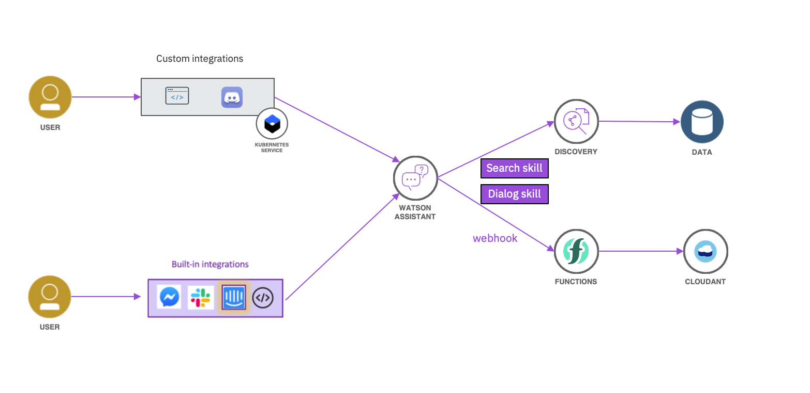

# Arquitectura de referencia

Os mostramos a continuación la arquitectura de referencia de los componentes principales que podéis emplear en el reto.

La arquitectura consta de una pieza central, que es el asistente virtual, basado en tecnología IBM Watson Assistant.
Este asistente guiará al usuario final a través de un diálogo programado para determinar las intenciones, palabras clave, etc.

En caso de que el asistente necesite acceder a información adicional para ofrecer una respuesta más compleja, o para hacer más rico el propio diálogo, puede acceder a diversos servicios en el backend. Ahi varias opciones posibles:
* Funciones serverless que acceden a una base de datos a buscar o actualizar información
* Integración con Watson Discovery para localización de información en base a determinados parámetros

Para la capa de front end, también contamos con varias alternativas, que van desde una integración sencilla del asistente en una página web, o integración con diferentes sistemas de mensajería que por defecto soporta Watson Asssitant. 

Otra opción es desarrollaros vuestro porpio cliente e integrar ahí la funcionalidad de WA invocando al API. Un ejemplo de esto es tambien la integración específica con Discord, que se ha desarrolldo ad-hoc para que podáis consultar cómo se acceder al API de Watson Assistant.
