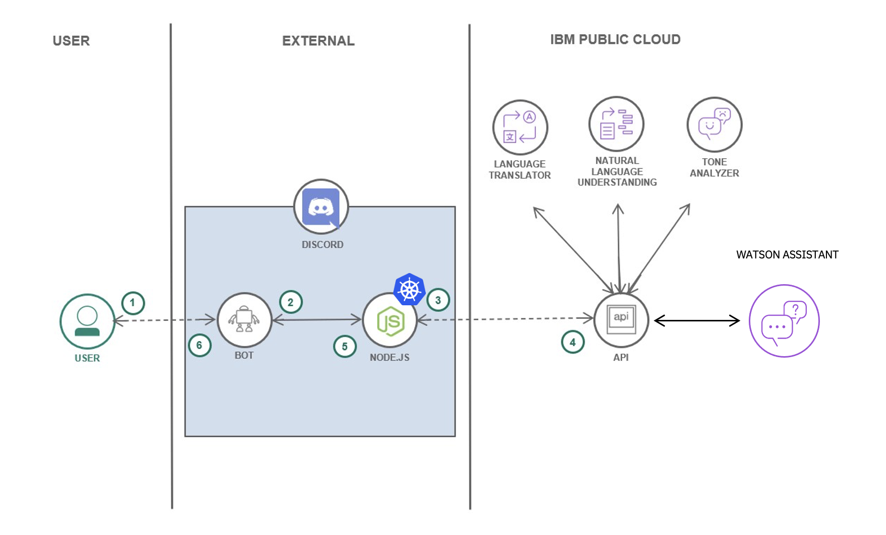

# Ejemplo de implementación

En esta sección podéis acceder a un tutorial y un patrón de código específico para desarrollar un asistente virtual e integrarlo con Discord. Desplegando también el bot sobre un cluster de Kubernetes. De esta manera podéis ver de una forma práctica cómo integrar diversas piezas de IBM Cloud y externas para dar más contenido a vuestra solución.

## En qué consiste el ejemplo

En este tutorial extenderás las capacidades de un bot de Discord dotándole de inteligencia artificial con diferentes recursos de Watson para, entre otras cosas, poder traducir texto, identificar el tono o incluso establecer un diálogo inteligente según lo configurado en el asistente virtual implementado con Watson Assistant.

Todos estos servicios de Watson los puedes desplegar de manera gratuita en en IBM Cloud.

También haremos que el bot está siempre activo desplegándolo en un cluster de Kubernetes. Lo integraremos con la plataforma de mensajería y llamadas de Discord, colocándolo en un servidor para clientes y colegas, todo esto mediante la programación sencilla en Node.js.
## Recursos

A continuación ponemos a tu disposición una serie de recursos para aprender más sobre ej ejemplo de integración de Watson, Kubernetes y Discord

* [Acceso al tutorial](https://github.com/luisreyesoliva/watson-discord)
* [Presentación integración y pasos a seguir](https://ibm.ent.box.com/file/921638476329)
* [Video de la sesión de enablement](https://www.crowdcast.io/e/-discord-chatbot-with)
