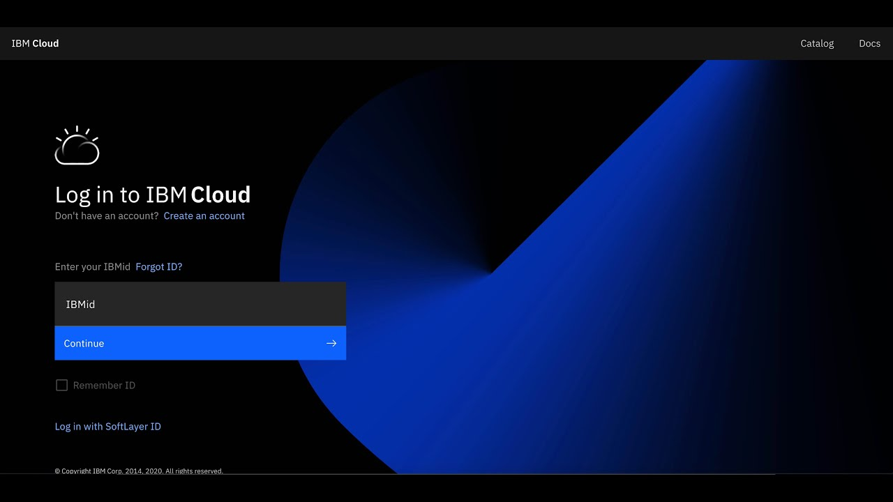

# Configuración del entorno

En esta sección os contamos como daros de alta en IBM Cloud para la realización del reto. Existen dos métodos para darte de alta en IBM Cloud para participar en el reto, a través de una cuenta trial creada para cada participante o por medio de una cuenta Proof-of-Concept (PoC) creada específicamente para la celebración del reto y compartida por todos los participantes. 

!!! warning 
    Por favor consulta con la organización del reto si desconoces cual es el método elegido para el reto en el que participas.

## Acesso a tu usuario de IBM Cloud

### Alta de usuario en cuenta PoC

Visita este [enlace](https://cloud.ibm.com/authorize/accountID-or-alias/realmID) para establecer tu usuario en la cuenta de IBM Cloud asignada para el reto. Una vez cargado, haz clic en el enlace *Olvidé mi contraseña*. 

Después de hacer clic en el botón *Restablecer contraseña*, visita la bandeja de entrada del correo electrónico proporcionado. Abre el enlace que se te ha enviado y establece una nueva contraseña personal antes de volver a vistitar la anterior URL. A continuación, recibiras un código de acceso único que deberás ingresar en el siguiente formulario. Finalmente, inicia sesión en la cuenta de IBM que se utiliza para el reto. 

### Alta de usuario en cuenta trial

Accede al siguiente [enlace](https://cloud.ibm.com/trial/) para darte de alta en una cuenta trial y acceder a IBM Cloud para la realización del reto.

## Creación de usuario en IBM Cloud

Una vez se te haya redireccionado a la página de inicio de sesión de IBM Cloud, pulse **Crear una cuenta de IBM Cloud** si así se te indica, y sigue estos pasos:

1. Especifica tu dirección de correo electrónico de IBMid. Si no tienes un IBMid existente, se crea un ID en función del correo electrónico que hayas especificado.

2. Rellena los campos restantes con tu información.

3. Pulsa **Crear cuenta**.

4. Confirma la cuenta pulsando en el enlace que aparece en el correo electrónico de confirmación enviado a la dirección de correo que has proporcionado.
