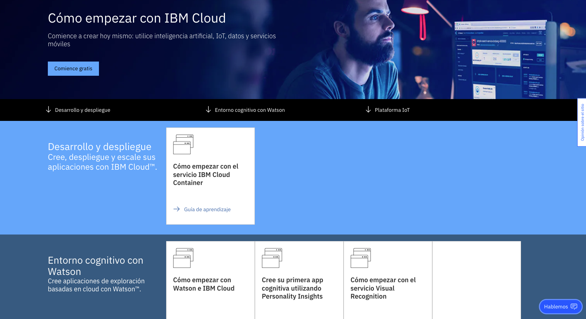
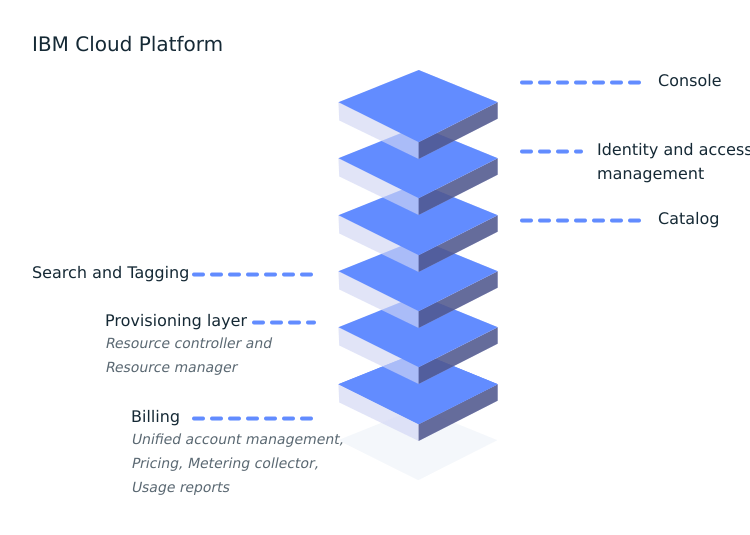
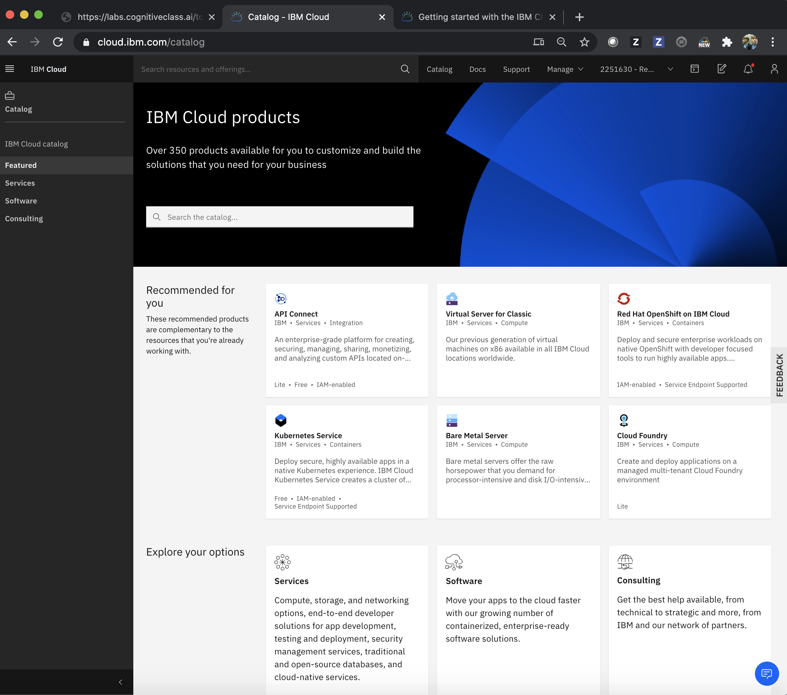
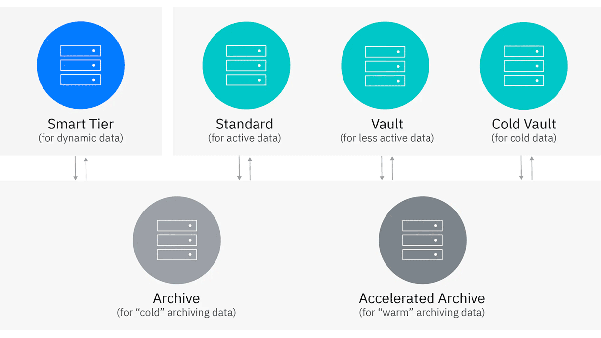

# Overview de IBM Cloud

En esta sección podéis acceder a material de consulta sobre IBM Cloud, su catálogo, y un overview de los servicios más interesantes del cara al reto. 

## ¿Qué es IBM Cloud?

La plataforma IBM Cloud combina plataforma como servicio (PaaS) con infraestructura como servicio (IaaS) para proporcionar una experiencia integrada. La plataforma escala y es compatible tanto con pequeños equipos y organizaciones de desarrollo como con grandes empresas. 

Como ilustra el siguiente diagrama, la plataforma IBM Cloud se compone de varios componentes que funcionan juntos para proporcionar una experiencia en la nube coherente y fiable:

* Una consola robusta que sirve como interfaz para crear, ver y administrar tus recursos en la nube.
* Un componente de gestión de identidades y accesos (IAM) que autentica de forma segura a los usuarios para los servicios de la plataforma y controla el acceso a los recursos.
* Un catálogo que consta de cientos de productos compatibles.
* Un mecanismo de búsqueda y etiquetado para filtrar e identificar tus recursos.
* Un gestión de cuentas y facturación que proporciona un uso exacto para planes de precios y protección segura contra fraudes de targetas de crédito.

## Catálogo IBM Cloud

Todos los productos que están disponibles en IBM Cloud se muestran de forma predeterminada en el catálogo. Puedes filtrar el catálogo por tipo para ver un tipo específico de producto. Ingresa palabras clave o estable filtros adicionales para ampliar el alcance de tu vista del catálogo.

Por ejemplo, si deseas implementar una instancia de análisis en Red Hat OpenShift en IBM Cloud, puedes seleccionar la categoría Análisis y filtrar los resultados seleccionando Red Hat OpenShift como destino de implementación.

## Servicios de infraestructura y almacenamiento

La infraestructura como servicio (IaaS) es un tipo de computación en la nube qu permite asignar tus recursos de cómputo, de red, de almacenamiento y de seguridad a demanda. IBM Cloud ofrece diversos servicios de infraestructura como servicio e infraestructura en la nube.

### IBM Cloud Virtual Server for VPC

En tu propio espacio privado en IBM Cloud, IBM Cloud VPC combina la seguridad de una nube privada con la escalabilidad de una nube pública. Virtual Private Cloud te permite aislar y aprovisionar segmentos de red en IBM Cloud donde implementar y administrar recursos.

Con Virtual Server for VPC puedes aprovisionar rápidamente instancios con alto rendimiento de red. Cuando aprovisiones una instancia, puedes seleccionar un perfil que coincida con la cantidad de memoria y potencia de cómputo que necesites para la aplicación que planees ejecutar en la instancia.

### IBM Cloud Object Storage

IBM Cloud Object Storage es un servicio de almacenamiento en la nube altamente escalable, diseñado para alta resilencia y seguridad. Puedes administrar y acceder a tus datos a través de APIs RESTful. Además, puedes conectar aplicaciones diractamente a Cloud Object Storage para utilizar otros servicios de IBM Cloud con tus datos.

Cloud Object Storage ofrece cuatro opciones de clase de almacenamiento para adaptarse a diferentes tipos de cargas de trabajo:

* Smart Tier: coste automático optimizado para datos de cualquier actividad y acceso.
* Standard: datos activos a los que se accede con frequencia.  
* Vault: datos menos activos a los que se accede una vez al mes.
* Cold Vault: datos 'fríos' a los que se accede varias veces al año.

## Servicios de bases de datos

DBaaS (también conodico como servicio de base de datos administrado) es un servicio de computación en la nube que te permite acceder y usar un sistema de base de datos en la nube sin comprar y configurar tu propio hardware, instalar tu propio software de base de datos o administrar la base de datos por ti mismo.

IBM Cloud ofrece una amplia gama de bases de datos que están altamente disponibles y listas para producción.

### IBM Cloudant

IBM Cloud te ofrece la opción de crear una instancia de Cloudant totalmente gestionada en IBM Cloud.

IBM Cloudant es una base de datos de documentos JSON totalmente gestionada que ofrece un escalado independiente sin servidor de la capacidad de rendimiento y el almacenamiento aprovisionados. Cloudant es compatible con Apache CouchDB y se puede acceder a través de una API HTTPS fácil de usar para aplicaciones web, móviles y de IoT.

### IBM Db2

El servicio de IBM Db2 en IBM Cloud es un almacén de datos relacional de alto rendimiento totalmente administrado que ejecuta el motor de base de datos Db2 de grado empresarial.

<!---
TODO: ## Servicios para el desarrollador
--->

## Recursos

A continuación ponemos a tu disposición una serie de recursos para aprender más sobre los servicios de IBM Cloud:

* [Presentaciones, tutoriales, recursos para aprender](https://ibm.box.com/s/nagrn4mwkj0jzsxhcti0y8x7cs2xx0i2).
* Video de la sesión de enablement.

