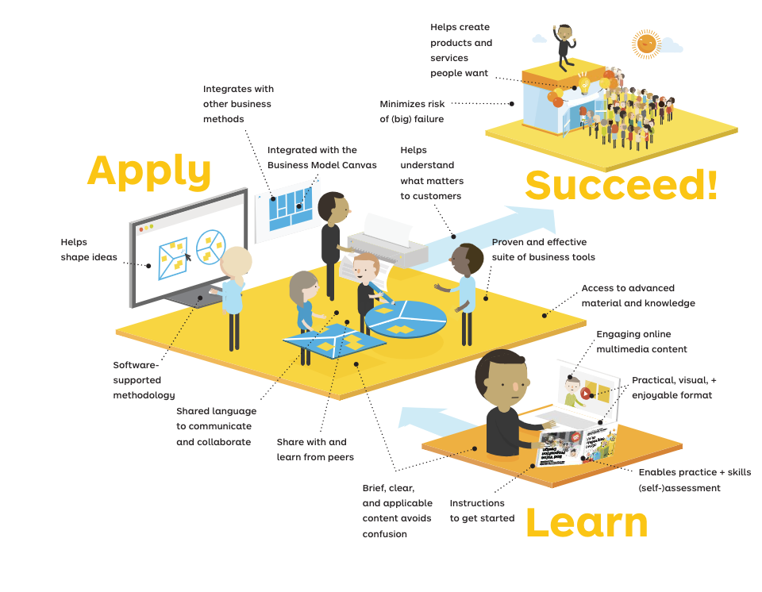

# Tips para MVPs

En esta sección podéis acceder a material de consulta sobre recomendaciones y buenas prácticas para llevar a cabo todo el proceso de creación y construcción de vuestra solución, basado en nuestra experiencia en el uso de la [Metodología Garage](https://www.ibm.com/garage/method/). 

## ¿Qué es la metodología Garage?

IBM integra prácticas que se basan en la experiencia, desde la implementación a escala global hasta el cambio cultural, en un enfoque único en integral: la Metodología IBM Garage. La Metodología impulsa el Design Thinking Empresarial a escala, se basa en principios ágiles para equipos ubicados y distribuidos, aprovecha las herramientas y técnicas de DevOps para la entrega y las operaciones continuas, fomenta el talento digital y el cambio cultural, y habilita Site Reliability Engineering.

La Metodología describe cómo comenzar a implementar las prácticas en tu organización. Los flujos de trabajo describen un conjunto de actividades que debes completar para obtener un resultado. Por ejemplo, un flujo de trabajo que describe cómo definir un producto viable mínimo (MVP) describe actividades y prácticas relacionadas para crear un MVP implementable.

## Recursos

A continuación ponemos a tu disposición una serie de recursos para aprender más sobre la metodología Garage y las recomendaciones más interesantes para organizarte el trabajo en tu MVP:

* Presentaciones, tutoriales, recursos para aprender.
* Video de la sesión de enablement.
