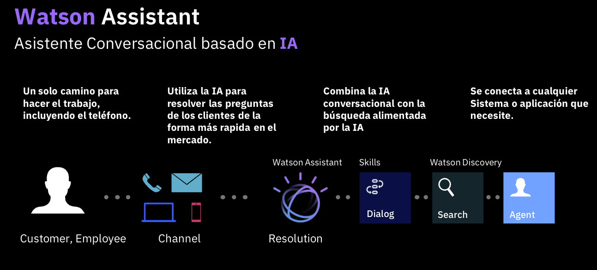

# Watson AI

En esta sección podéis acceder a material de consulta sobre los servicios de AI del catálogo de IBM Cloud. En particular Watson Assistant, las APIs de Watson y Watson Discovery

## ¿Qué es IBM Watson?

Un portfolio de IBM de aplicaciones, herramientas y soluciones preparadas para la empresa, diseñado para reducir los costes y los obstáculos de la adopción de IA, además de optimizar los resultados y el uso responsable de la IA.

## Qué es Watson Assistant

Watson Assistant is the industry-leading conversational AI platform that your customers, human agents and employees actually want to use. With Watson Assistant, you can reduce costs and customer churn, while improving the human agent and customer experience — and achieve a 310% ROI over three years. And since it can be deployed in any cloud or on-premises environment, smarter AI for customer service is finally available wherever you need it.

Utiliza IBM Watson Assistant para crear tu propio chatbot en vivo en cualquier dispositivo, aplicación o canal. Tu chatbot, que también se conoce como asistente, se conecta tus recursos de participación que ya utilizas para brindar a tus usuarios una experiencia de resolución de problemas unificada y atractiva. Para conseguir esto:

- Los usuarios interactúan con el asistente a través de uno o más de estos canales: una plataforma de redes sociales existente como Slack, Facebook Messenger o WhatsApp; una llamada telefónica o un mensaje de texto; un chat web; o una aplicación que tu desarrolles.

- El asistente recibe un mensaje de un cliente y lo envía por la ruta de resolución apropiada.

Explora aquí la tecnología de [Watson Assistant](https://www.ibm.com/products/watson-assistant) y descubre cómo diseñar una conversación basada en inteligencia artifial.

## Qué es Watson Discovery

Watson Discovery es una tecnología de IA que habla el lenguaje de búsqueda de la información. Con la búsqueda de IA líder en el mercado, como Watson Discovery, puedes detectar tendencias emergentes, realizar análisis predictivos y obtener información operativa. Utiliza el análisis de texto y el procesamiento del lenguaje natural (NLP) para romper los silos de datos abiertos y recuperar respuestas específicas a sus preguntas, al mismo tiempo que extraes datos para analizar e identificar las relaciones ocultas en los datos.

Explora aquí la tecnología de [Watson Discovery](https://www.ibm.com/cloud/watson-discovery) y descubre cómo encontrar respuestas críticas e insights de tus datos a través de una tecnología de búsqueda basada en AI. 

## Qué son Watson APIs

Las API de Watson facilitan la incorporación de análisis de conversación, lenguaje y texto avanzado en sus aplicaciones.

Explora aquí la tecnología de [Watson APIs](https://www.ibm.com/watson/products-services) y descubre modelos de AI preentrenados para realizar diversas funciones. 

## Recursos

A continuación ponemos a tu disposición una serie de recursos para aprender más sobre los servicios de IBM Watson:

* [Presentación de IBM Watson](https://ibm.box.com/s/9vjg1rg0ucroqsx52vw0t6h4kg9w7pnn)
* [Integra IBM Watson Assistant y IBM Watson Discovery](https://www.ibm.com/cloud/architecture/content/course/integrate-ibm-watson-assistant-and-watson-discovery/connect-to-a-data-source/)
* [Integración de Watson Assistant con WhatsApp](https://developer.ibm.com/es/tutorials/integrating-ibm-watson-assistant-with-whatsapp/)
* [Cámbiate a Serverless en Watson Assistant con IBM Cloud Functions](https://developer.ibm.com/technologies/artificial-intelligence/tutorials/go-serverless-in-watson-assistant-with-ibm-cloud-function/)
* [Comienza con Watson Assistant](https://developer.ibm.com/learningpaths/get-started-watson-assistant/)
* [Video de la sesión de enablement](https://www.crowdcast.io/e/create-tu-chatbot-en-30)
